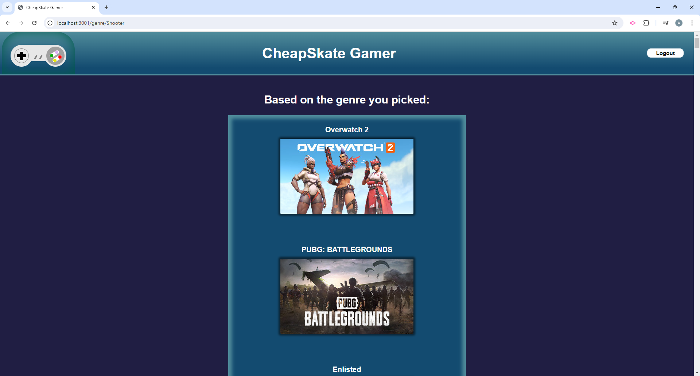

# CheapSkate-Gamer

## Description

The goal for this application was to provide a way for gamers with little money to spare to find fun free to play games to enjoy. The application has a wide selection of free to play games that users will be able to search through. The user can search for a game by title which will take the user to a game page showing all the relevent information about the game as well as reviews about the game written by other users. The game page will also have a url link that will take the user to a site where they can download the game should they want to play it. The application also has a genre search option so that users can find games related to what game genre they enjoy playing. Lastly, users will be able to write their own reviews for games that they played provided that they sign up or log in to their account in the application.

## Installation

N/A. All setup will be handled by Render.

## Usage

Below are screenshots showing the homepage, and examples of a specific game search and a genre search.

## Credits

William Zovistoski: [GitHub Link](https://github.com/WillZovo94)

Christopher Glenn: [GitHub Link](https://github.com/TalanvorD)

Aaron Richter: [GitHub Link](https://github.com/anrichter2)

Pengsue Thao: [GitHub Link](https://github.com/PengsueT)

Caden Carlson: [GitHub Link](https://github.com/Cadcar01)

Also a special thanks to these third party sites

[Bulma](https://bulma.io/)

[Freetogame](https://www.freetogame.com/)

## License

MIT

## Contribute

N/A

## Links

[GitHub Repo](https://github.com/WillZovo94/CheapSkate-Gamer)

[Render URL]()